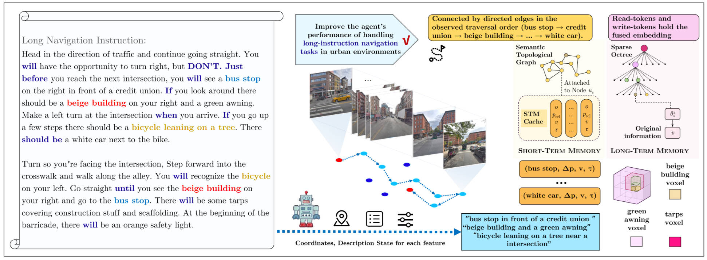

# Mem4Nav
Mem4Nav is a novel memory system designed to augment Vision-and-Language Navigation (VLN) agents by providing a hierarchical spatial understanding and robust long-short term memory capabilities. It fuses a sparse octree for fine-grained voxel indexing with a semantic topology graph for high-level landmark connectivity, storing observations in these structures via trainable memory tokens embedded by a reversible Transformer.



## Overview

Vision-and-Language Navigation (VLN) in large-scale urban environments requires embodied agents to ground linguistic instructions in complex visual scenes and recall relevant experiences over extended periods. Mem4Nav addresses these challenges by introducing a hierarchical memory system that augments existing VLN agent backbones.

Key components of Mem4Nav:
* **Sparse Octree**: For efficient, fine-grained 3D spatial indexing of visual observations using Morton codes.
* **Semantic Topology Graph**: A dynamic graph representing high-level spatial relationships, with nodes as landmarks/intersections and edges as traversable paths.
* **Long-Term Memory (LTM)**: Uses a reversible Transformer to losslessly compress and store historical observations as memory tokens associated with octree leaves and graph nodes.
* **Short-Term Memory (STM)**: A fixed-capacity cache for recent multimodal observations in relative coordinates, enabling rapid local lookup and dynamic obstacle awareness using an FLFU-inspired eviction policy.
* **Multi-Level Retrieval**: A strategy that prioritizes STM and falls back to LTM, providing relevant memory cues to the agent's policy.


## Features

* Implementation of the core Mem4Nav system: Octree, Semantic Graph, LTM (with Reversible Transformer), STM, and Memory Retrieval logic.
* Integration of Mem4Nav with three VLN agent backbones: Modular, VELMA, and FLAME.
* Modular code structure for perception, mapping, planning, control, and agent policies.
* Data loaders for Touchdown and Map2Seq datasets.
* A three-phase training pipeline as described in the paper.
* Evaluation framework with standard VLN metrics (TC, SPD, nDTW, SPL).
* Configuration-driven experiments using YAML files for easy management and reproducibility.
* Docker support for a consistent and reproducible environment.

## Project Structure
```
mem4nav\_reproduction/
├── main.py                 \# Main script for training and evaluation
├── README.md               \# This file
├── requirements.txt        \# Python package dependencies
├── Dockerfile              \# For reproducible environment setup
│
├── configs/                \# YAML configuration files for experiments
│   ├── base.yaml             \# Base configuration with shared parameters
│   ├── modular\_touchdown.yaml
│   ├── modular\_map2seq.yaml
│   ├── velma\_touchdown.yaml
│   ├── velma\_map2seq.yaml
│   ├── flame\_touchdown.yaml
│   └── flame\_map2seq.yaml
│
├── mem4nav\_core/           \# Core components of the Mem4Nav system
│   ├── spatial\_representation/ \# Octree and Semantic Graph
│   ├── memory\_system/          \# LTM, STM, Reversible Transformer, Memory Retrieval
│   └── perception\_processing/  \# Feature extraction and fusion utilities (using UniDepth)
│
├── agents/                 \# VLN agent backbones and Mem4Nav integration
│   ├── base\_vln\_agent.py       \# Abstract base class for VLN agents
│   ├── modular\_pipeline/       \# Custom Hierarchical Modular Agent
│   ├── velma\_integration/      \# VELMA + Mem4Nav
│   └── flame\_integration/      \# FLAME + Mem4Nav
│
├── data\_handling/          \# Dataset loaders and preprocessing utilities
│   ├── base\_loader.py
│   ├── touchdown\_loader.py
│   ├── map2seq\_loader.py
│   ├── graph\_loader.py         \# For loading navigation graphs (Touchdown, Map2Seq)
│   └── utils.py                \# Tokenization, text processing
│
├── training\_utils/         \# Modules for training the agents
│   ├── losses.py               \# Navigation and cycle-consistency losses
│   ├── optimizers.py           \# Optimizer and scheduler setup
│   └── trainer.py              \# Main training loop logic for different phases
│
├── evaluation\_utils/       \# For evaluating agent performance
│   ├── metrics.py              \# Implementation of TC, SPD, nDTW, SPL
│   └── evaluator.py            \# Runs episodes and calculates metrics
│
├── external\_models/        \# Third-party models like UniDepth
│   ├── velma
│   ├── flame
│   └── unidepth/               \# UniDepth model code 
└── utils/                  \# General utility functions
├── config\_parser.py
├── logging\_setup.py
└── general\_helpers.py
```

## Setup and Installation

### Prerequisites
* Linux (recommended, tested on Ubuntu 20.04)
* NVIDIA GPU with CUDA support (CUDA 11.8 or compatible is recommended for PyTorch versions specified
* Python 3.9+ (Python 3.10 recommended and used in Dockerfile)

### Cloning the Repository
```bash
git clone <repository_url> mem4nav_reproduction
cd mem4nav_reproduction
````


### Downloading Pre-trained Models
Pre-trained models have been provided [here](), please download and extract them to the external_models directory.

1.  **UniDepth**:

      * Clone or download the UniDepth model codebase into `external_models/unidepth/`. Ensure it's importable.
      * Download the pre-trained UniDepth weights (e.g., `unidepth_v2_vitl14_nodepth2mask.pth`).
      * Update the `mem4nav_core.perception_processing.unidepth_model_path` and `agents.*.perception.multimodal_feature_processor.unidepth.config_path` in your YAML configuration files to point to the downloaded weights and the corresponding UniDepth model JSON config file.

2.  **FLAME/VELMA Backbones**:

      * For **FLAME**: Download the pre-trained FLAME model checkpoint. Update `agents.flame_agent.flame_model_path` in `configs/flame_*.yaml`.
      * For **VELMA**:
          * If using a local LLM (e.g., LLaMA), download its weights. Update `agents.velma_agent.llm_model` in `configs/velma_*.yaml` to the Hugging Face path or local path. Ensure you have `hf_auth_token` if needed.
          * If using OpenAI, ensure your `OPENAI_API_KEY` environment variable is set.
          * VELMA also uses pre-extracted CLIP features for landmarks/images. The original VELMA README would have instructions for these.

## Configuration

  * `configs/base.yaml`: Contains default parameters shared across all experiments.
  * Experiment-specific files (e.g., `configs/modular_touchdown.yaml`, `configs/flame_map2seq.yaml`): These load `base.yaml` (implicitly via `main.py`) and override parameters for specific agent-dataset combinations.

**Key parameters to check and update in your YAML files:**

  * `experiment.output_dir_root`: Where all results, logs, and checkpoints will be saved.
  * `data_handling.dataset_root_path`: Root directory for all your datasets.
  * `data_handling.*_loader.specific_path`: Path to the specific dataset directory (Touchdown, Map2Seq splits) relative to `dataset_root_path`.
  * `data_handling.*_loader.landmarks_file_path`: Path to pre-extracted landmark files (if used).
  * `mem4nav_core.perception_processing.unidepth_model_path`: Path to UniDepth model weights.
  * `agents.*_agent.*_model_path`: Paths to pre-trained FLAME or VELMA (local LLM) models.
  * `agents.velma_agent.graph_dir`: Path to VELMA's navigation graph data for the specific dataset.
  * `agents.flame_agent.flame_h_prev_dim`, `flame_f_bar_t_dim`, `flame_vis_latent_dim`: These must match the specifics of the FLAME model variant you are using.

The `main.py` script will create a unique timestamped subdirectory under `experiment.output_dir_root/experiment.name/` for each run and save the effective configuration (`effective_config.yaml`) there.

## Running Experiments

The main script for running training and evaluation is `main.py`.

### Evaluation

To evaluate a trained agent, use the `evaluate` run mode and provide the path to a saved checkpoint:

```bash
python main.py \
    --config_base configs/base.yaml \
    --config_experiment configs/your_experiment_config.yaml \
    --run_mode evaluate \
    --agent_type <modular|velma|flame> \
    --checkpoint_path /path/to/your/agent_checkpoint.pth \
    [--eval_split <dev|test_seen|test_unseen|...>] \
    [--output_dir_override /path/to/custom_outputs]
```

  * The `Evaluator` will run the agent on the specified evaluation split.
  * Metrics (TC, SPD, nDTW, SPL) will be computed and saved as a JSON file in the experiment's output directory, under a `results/` subfolder.
  * **Environment Graph**: Ensure the `graph_dir_template` or specific graph paths in `data_handling` config are correct for the dataset being evaluated, as the `Evaluator` needs this for geodesic distance calculation and simulating navigation. A `data_handling/graph_loader.py` is provided to load these graphs.


## Code Modules

  * **`mem4nav_core/`**: Contains the core Mem4Nav system modules.
      * `spatial_representation/`: `SparseOctree` and `SemanticGraph`.
      * `memory_system/`: `LongTermMemory`, `ShortTermMemory`, `ReversibleTransformer`, `MemoryRetrieval`.
      * `perception_processing/`: `MultimodalFeatureProcessor` (using `VisualFrontend` and `UniDepthModel`) for generating fused observation embeddings $v\_t$.
  * **`agents/`**: Implements the VLN agent backbones and their integration with Mem4Nav.
      * `base_vln_agent.py`: Abstract base class.
      * `modular_pipeline/`: The custom Hierarchical Modular Pipeline.
      * `velma_integration/`: VELMA agent augmented with Mem4Nav.
      * `flame_integration/`: FLAME agent augmented with Mem4Nav.
  * **`data_handling/`**: Dataset loaders (`TouchdownDatasetLoader`, `Map2SeqDatasetLoader`), graph loader (`VLNGraphLoader`), and text processing utilities.
  * **`training_utils/`**: Modules for the training pipeline (`Trainer`, `losses.py`, `optimizers.py`).
  * **`evaluation_utils/`**: Modules for evaluation (`Evaluator`, `metrics.py`).
  * **`external_models/`**: Directory to place third-party model code like UniDepth.
  * **`utils/`**: General utilities (`config_parser.py`, `logging_setup.py`, `general_helpers.py`).
  * **`configs/`**: YAML configuration files.
  * **`main.py`**: Main script to run experiments.
